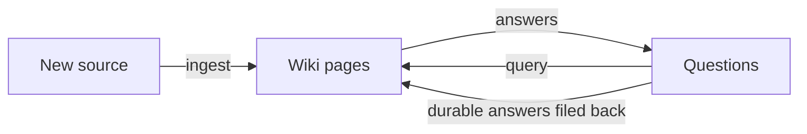
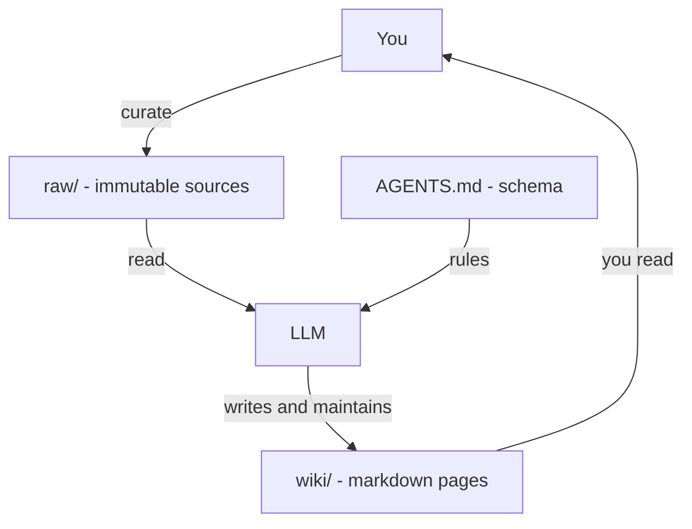

# LLM Wiki Template

An LLM wiki template that turns curated `raw/` sources into a persistent markdown knowledge base. It follows the LLM wiki pattern from Andrej Karpathy's [gist](https://gist.github.com/karpathy/442a6bf555914893e9891c11519de94f).

## What is an LLM wiki?

Most tools that work with documents use retrieval. You upload files, and at query time the model pulls the relevant chunks and writes an answer from them. This works, but the model rebuilds its knowledge on every question. Nothing accumulates, and a subtle question that spans several documents means reassembling the same fragments each time.

An LLM wiki works the other way. The model reads each source once and writes what it learned into a folder of interlinked markdown pages. It updates entity pages, revises summaries, flags where new material contradicts old claims, and keeps a running synthesis. Knowledge gets compiled once and then kept current, instead of being re-derived on every query.

The result is a persistent, compounding artifact. Cross-references already exist, contradictions are already flagged, and each source you add or question you ask makes the wiki richer.

You rarely write the wiki yourself. You curate sources, explore, and ask questions; the model does the summarizing, cross-referencing, filing, and bookkeeping. Many people keep the agent open on one side and Obsidian on the other, browsing the updated pages as the model edits.

## How it works

The basic model is `raw/ -> wiki/`.

Three layers sit between you and the sources:

- `raw/` holds curated source documents: articles, papers, images, and data files. These are immutable. The model reads them but never modifies them.
- `wiki/` holds the markdown pages the model owns: source summaries, entity pages, concept pages, and syntheses.
- `AGENTS.md` is the schema. It tells the model how the wiki is structured, what the conventions are, and what to do when ingesting, answering, or maintaining.

The writing model is plain-language, answer-first wiki prose: teach the smallest useful model first, then deepen it with evidence, distinctions, examples, limits, and open questions.

## Repo structure

- `raw/` - curated source documents
- `wiki/` - persistent markdown wiki and navigation surfaces
- `AGENTS.md` - root contract for structure, workflows, and page types
- `.agents/skills/` - repo-local skill playbooks for writing, ingest, query, read-only query, and maintenance work

## Workflow

1. Add curated source material to `raw/`.
2. Follow `AGENTS.md` for the always-on contract and load the relevant repo-local skills from `.agents/skills/`.
3. Create or update pages in `wiki/sources/`, `wiki/entities/`, `wiki/concepts/`, and `wiki/syntheses/`.
4. Use synthesis pages for reusable questions, comparisons, and topic maps.
5. Keep `wiki/index.md`, learning paths, and `wiki/log.md` up to date.

## Operations

- `ingest` - integrate curated material from `raw/` into `wiki/` and update related pages, the index, and the log.
- `query` - answer from the wiki first, then fold durable answers back into the knowledge base when they deserve a synthesis page.
- `wiki` - answer from the wiki first in read-only mode, never writing or modifying any file.
- `lint` - check wiki health, including structure, link integrity, stale claims, and integration gaps.
- `refresh` - detect raw-source drift and report the downstream pages that should be revisited.

## Credits

This template began from [caelaxie/llm-wiki-template](https://github.com/caelaxie/llm-wiki-template), which laid the foundation for the `raw/ -> wiki/` model this repo builds on. The underlying idea comes from Andrej Karpathy's [LLM Wiki gist](https://gist.github.com/karpathy/442a6bf555914893e9891c11519de94f).
