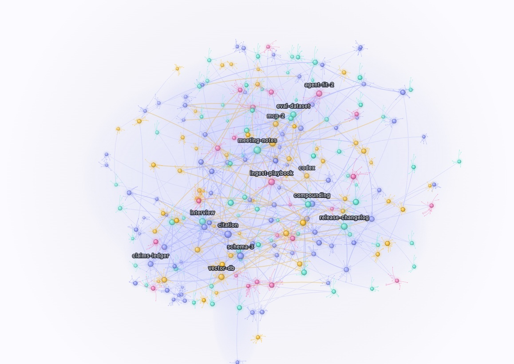
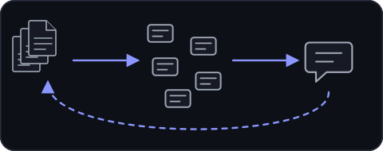
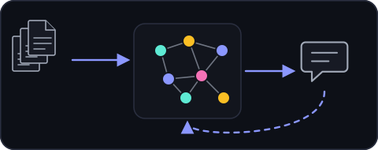
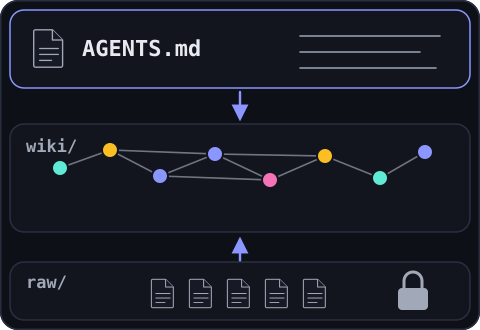
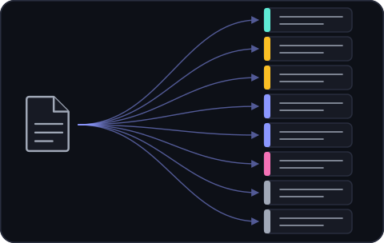
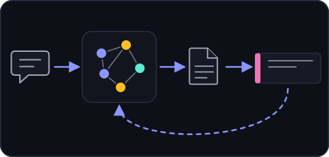
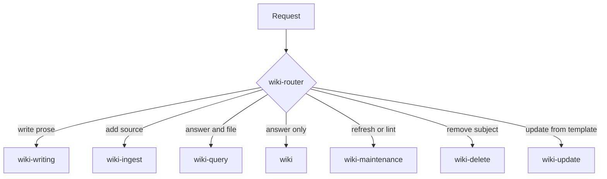

# LLM Wiki

**Let your AI assistant write the wiki you never had time for.**

**A template for starting your own LLM wiki.** Add files, links or pasted text. Your assistant reads them with its wiki skills, writes linked markdown pages, and answers your questions from those pages, citing them. The wiki is plain files in git: no database, no API keys. It works with Claude Code, Cursor, GitHub Copilot, OpenCode and Codex.

[Live site](https://jonyfs.github.io/llm-wiki-template/) · [Use this template](https://github.com/jonyfs/llm-wiki-template/generate) · [Start in five minutes](#5-start) · [The original gist](https://gist.github.com/karpathy/442a6bf555914893e9891c11519de94f)

<p align="center">
  <picture>
    <source media="(prefers-color-scheme: dark)" srcset="docs/images/graph-dark.jpg">
    
  </picture>
</p>

<p align="center"><sub>A made-up wiki in the shape of a brain, captured from the live graph on the site. Each cell is a page, each line is a <code>[[wikilink]]</code>, and pages with more links grow bigger. GitHub does not run the animation, so this is a still.</sub></p>

## In short

LLM Wiki Template is a starting point for your own LLM wiki. Clone it, add your sources, and your assistant turns them into linked markdown pages, so you ask the wiki instead of digging through files.

- **What it can do.** It reads the files, links and pasted text you give it. It writes a page for each source, plus pages for the people, ideas and comparisons inside them, and answers your questions from those pages with citations.
- **What it solves.** Tools that answer from documents rebuild the answer from fragments on every question, so nothing builds up. Here the summarizing, linking and spotting of contradictions happens once and stays on the page.
- **What it is for.** Any subject you keep reading about: a course, a research topic, client files, a team's decisions. It suits you if you want answers you can check and notes that stay current without you maintaining them.

New here? Read the five parts in order, or jump to the one you need: [1 Understand the idea](#1-understand-the-idea) · [2 See it working](#2-see-it-working) · [3 Use it](#3-use-it) · [4 Why it pays off](#4-why-it-pays-off) · [5 Start](#5-start)

---

## 1. Understand the idea

Everything in this part paraphrases [Andrej Karpathy's gist](https://gist.github.com/karpathy/442a6bf555914893e9891c11519de94f), using the names this template gives things.

### The problem: asking your documents a question

Most tools that answer from documents work like the first picture. The gist puts NotebookLM, ChatGPT file uploads and most RAG setups in that group.

| Retrieval, the usual way | An LLM wiki |
|---|---|
|  |  |
| 1. You upload files.<br>2. When you ask, the tool pulls out the pieces that look relevant.<br>3. The model writes a fresh answer from those pieces.<br>4. The next question starts again at step 2. Nothing is kept. | 1. You add a source.<br>2. The assistant reads it once and writes or updates linked pages.<br>3. Later questions start from those pages, with links and flagged contradictions already there.<br>4. The pages stay, and every new source or answer adds to them. |

Example: you save five papers about sleep. Ask how they disagree and a retrieval tool digs through fragments of all five again, every time. In a wiki, the page on sleep and memory already says where paper 2 and paper 4 disagree, and cites both.

### Who does what

You decide what goes in and what to ask. The assistant does the upkeep.

| You | The assistant |
|---|---|
| Pick the sources. | Summarizes each source. |
| Ask the questions. | Links related pages. |
| Read the pages and decide what it all means. | Files everything in the right place. |
| | Keeps summaries current and flags contradictions. |

Karpathy compares it to programming: Obsidian is the editor, the assistant is the programmer and the wiki is the codebase. Obsidian is optional here. Any markdown editor, or just your file browser, works.

### Three layers

Each layer has one owner. That keeps the sources trustworthy and the pages consistent.

<p align="center"></p>

- **The schema** is a short instruction file (here, `AGENTS.md` plus the skills in `.agents/skills/`) that says how the wiki is laid out and what to do for each kind of request. You and the assistant refine it as you learn what works.
- **The wiki** is the markdown pages the assistant writes: summaries, entity and concept pages, comparisons, syntheses. You read them. The assistant owns them and keeps them consistent.
- **Raw sources** are your articles, papers, images and data files. They never change. This is the source of truth.

Example: reading a novel. The chapters you save are the raw layer. The wiki gets a page for each character and theme. The schema can say that every character page lists the chapters where that person appears.

### Three operations

Everything you do with the wiki is one of these.

#### Ingest



You add a source and ask the assistant to process it. It reads the source, talks through the main points with you if you like, writes a summary page, updates the index, updates the entity and concept pages the source touches, and adds a line to the log.

One source can change 10 to 15 pages. The gist prefers ingesting one source at a time and staying involved: reading the summaries and steering what to emphasize. You can also ingest many at once with less supervision. Whichever you pick, write the workflow into the schema so the next session follows it.

Example: you add a transcript of a podcast about sleep. The assistant writes a page for the episode, adds a paragraph to the page on melatonin, creates a page for the guest and links the three. In this template that is the `wiki-ingest` skill.

<br clear="right">

#### Query



You ask a question. The assistant searches the wiki, reads the relevant pages and answers with citations. The answer can be a page, a table, a slide deck or a chart, whatever fits the question.

A good answer can also be filed back into the wiki as a new page. A comparison you asked for or a connection you found should not vanish into chat history.

Example: you ask for a comparison of two note apps and like it, so the assistant saves it as a synthesis page. A month later you ask a follow-up and it starts from that page. In this template that is the `wiki-query` skill, or `wiki` when nothing may be written.

<br clear="right">

#### Lint


From time to time, ask the assistant to check the wiki's health. It looks for:

- pages that contradict each other
- claims that newer sources have replaced
- orphan pages that nothing links to
- ideas mentioned often but without a page of their own
- missing cross-references between related pages
- gaps that a web search could fill

It is also good at suggesting what to read or ask next. In this template, lint and refresh live in the `wiki-maintenance` skill.

<br clear="right">

### Index and log

Two plain files help both of you find your way as the wiki grows.

`wiki/index.md` is a catalog of every page: a link, a one-line summary, grouped by category. The assistant updates it on every ingest and reads it first when you ask something. The gist says this works well up to roughly a hundred sources and a few hundred pages, with no search infrastructure.

`wiki/log.md` records what happened and when: ingests, questions, lint passes. It only ever grows. Start every entry with the same prefix and simple tools can read it:

```text
## [2026-04-02] ingest | Sleep podcast transcript
## [2026-04-03] query | How do the sleep papers disagree?
## [2026-04-09] lint | 3 orphan pages found
```

```bash
grep "^## \[" wiki/log.md | tail -5    # the last five entries
```

### The vocabulary

| Term | Meaning |
|---|---|
| Source page | One page per raw file. It summarizes what the source says and numbers its claims so other pages can cite them, like `[[slug]] C1`. |
| Entity page | A person, company, product or place that shows up in more than one source. |
| Concept page | An idea, method or theme. It explains the thing and links to the sources behind it. |
| Synthesis page | The saved answer to a question that needed several pages. |
| Wikilink | A `[[slug]]` link from one page to another. Obsidian reads them too. |
| Frontmatter | A small block of YAML at the top of each page with title, type, sources and dates. The lint script checks it. |
| Skill | A markdown file in `.agents/skills/` that tells the assistant how to do one job, such as ingest, query or lint. |

---

## 2. See it working

The graph at the top of this page is simulated data in the shape of a brain, not a real wiki. On the [live site](https://jonyfs.github.io/llm-wiki-template/) it turns, and three buttons play the operations from part 1: adding a page is an ingest, asking the wiki is a query, and running lint is a lint. Cells have different shapes by page type, so the type reads without the color: pyramidal cells for sources, star-shaped ones for entities, branched ones for concepts and large ones for syntheses.

---

## 3. Use it

### What you can add

Start with what you already have. You choose the sources, and the assistant never edits them.

| Source | How it works |
|---|---|
| Files on your computer | Notes, markdown, text, PDFs, images and data files such as CSV. Give the path to `wiki-ingest`. It asks before saving a copy in `raw/`, then ingests it. |
| Links from the web | Hand `wiki-ingest` a link and it asks whether to save the page into `raw/` first. If you say yes, it keeps a clean copy and notes the date it was fetched. |
| Text you paste | An email, a chat thread or a transcript, pasted into `wiki-ingest`. It asks before saving it as a file in `raw/`, then ingests it like any other source. |
| Screenshots and scans | Images count as sources too. The assistant separates what it can read in the image from what it is guessing, and says so when it can't read one reliably. |

Whatever the format, the assistant needs a tool that can read it. If it can't, it tells you instead of guessing.

### Every request goes through a skill

When you ask the assistant to ingest, answer or remove something, `AGENTS.md` tells it to load the matching skill first. That is why every answer is built the same way: it starts from the index, uses your pages, cites them and logs any change it makes. These are instructions the assistant follows, not a lock, so if an answer looks like it skipped the wiki, ask it to use the wiki skill and cite its pages.

| You say | Skill | What happens |
|---|---|---|
| Ingest this file or link | `wiki-ingest` | Reads the source, writes or updates the pages it affects, then updates the index and log. A link or pasted text is saved to `raw/` first, and only after you say yes. |
| What does the wiki say about X? | `wiki-query` | Starts from the index, reads the relevant pages, opens raw files only to verify, and cites what it used. It can save a useful answer as a synthesis page. |
| Just tell me, don't change anything | `wiki` | The same lookup, but it cannot write, create or delete a file. |
| Check the wiki | `wiki-maintenance` | Lint looks for broken links, missing fields and orphan pages. Refresh reports raw files that changed after their page was written. |
| Remove everything about X | `wiki-delete` | Lists every mention, shows what would change and waits for your confirmation. It never touches raw files. |
| Write or fix a page | `wiki-writing` | Sets the page type, headings, frontmatter and citation style before any wiki prose is written. |
| Update this notebook from the template | `wiki-update` | Dry-runs the template's changes, applies them on a branch, merges the files you customized and records the new base. It never touches `raw/` or wiki pages. |
| Not sure what to ask | `wiki-router` | Picks exactly one of the skills above, or asks you one question. |

Shortcut commands in `.agents/commands/` call the same skills: `/wiki-ingest`, `/wiki-query`, `/wiki` (read-only), `/wiki-lint`, `/wiki-refresh` and `/wiki-update`.


```mermaid
flowchart TD
    R[Request] --> ROUTER{wiki-router}
    ROUTER -->|write prose| WW[wiki-writing]
    ROUTER -->|add source| WI[wiki-ingest]
    ROUTER -->|answer and file| WQ[wiki-query]
    ROUTER -->|answer only| W[wiki]
    ROUTER -->|refresh or lint| WM[wiki-maintenance]
    ROUTER -->|remove subject| WD[wiki-delete]
    ROUTER -->|update from template| WU[wiki-update]
```

### Examples from an ordinary week

Made-up situations, but the steps are the real ones.

- **Studying for an exam.** You keep lecture PDFs, your class notes and two articles you found online. You run `wiki-ingest` on all of it, and it saves the links into `raw/` after you approve. Before the exam you ask: "What did the course say about Keynes, and where does the article disagree?" The answer cites the lecture page and the article page.
- **Running a small business.** You drop in proposals, signed contracts, meeting notes and emails exported as text. Months later: "What did I promise this client about delivery, and did the scope change?" The assistant points to the proposal and to the later email, and says where they differ.
- **Planning a trip.** You save a few blog posts as links, the booking confirmation as a PDF and screenshots of the map. You ask: "We land on Sunday night and the museum closes on Mondays. Which day works?" The answer comes from your saved sources, and each claim links to the page it came from.
- **Keeping a team's decisions.** You add meeting notes, design docs and issue threads over a few months. A new teammate asks: "Why did we pick Postgres?" The assistant answers from the decision pages and can save the answer as a synthesis page, so the next person finds it already written.

In each case, `wiki-query` handles the questions and `wiki-ingest` handles every source you add.

### Folder map

```
.
├── AGENTS.md                 # always-on rules for structure and workflows
├── .agents/
│   ├── skills/               # step-by-step playbooks for each task
│   └── commands/             # short commands that invoke the playbooks
├── raw/                      # your curated, read-only source documents
├── wiki/                     # the assistant-maintained notebook
│   ├── index.md              # catalog of pages and learning paths
│   ├── log.md                # append-only record of operations
│   ├── sources/              # one page per source (optional subject subfolder)
│   ├── entities/             # people, organizations, products, places
│   ├── concepts/             # ideas, methods, theories
│   └── syntheses/            # comparisons, maps, durable answers
├── scripts/                  # lint, refresh, search, the new-llm-wiki.sh starter and the update-llm-wiki.sh updater
├── tests/                    # checks that keep the template healthy
├── docs/                     # migration notes and the README images
└── github-pages/             # the template's own site (the starter script removes it)
```

Multi-agent entry points (`CLAUDE.md`, `.cursorrules`, `.github/copilot-instructions.md`, `.claude/`, `.opencode/`) are links to the same source of truth, so one edit reaches every assistant.

### Keeping the wiki healthy

- **refresh** (`/wiki-refresh`) detects when a source has changed and reports which pages to revisit.
- **lint** (`/wiki-lint`) checks structure, link integrity, stale claims and integration gaps.
- **search** is a script, `scripts/wiki_search.py`, that `wiki-query` runs when the wiki is large. You ask the question and the skill does the lookup.
- **tests** keep the template itself healthy, for people who change it: `python3 -m unittest discover -s tests -t .`

---

## 4. Why it pays off

Plain files, a few scripts and instructions your assistant follows. Nothing runs in the background.

- **Answers you can check.** Claims in wiki pages carry a footnote that points at the raw file. When the assistant answers, it names the pages it used, so you can open them.
- **Your sources stay untouched.** The assistant reads `raw/` but never edits it. Everything it writes goes into `wiki/`, and git keeps the history.
- **A record of every change.** `wiki/index.md` lists every page. `wiki/log.md` records what the assistant did and when.
- **Good answers get reused.** A useful answer can be saved as a synthesis page. The next similar question starts from that page instead of the raw files.
- **Problems show up early.** Lint catches broken links and missing fields. Refresh tells you when a raw file changed after its page was written.
- **Removing things is safe.** Removing a subject lists every mention first and waits for your yes. The raw files stay where they are.

### Why this works

Keeping a knowledge base up to date is mostly bookkeeping: fixing cross-references, rewriting summaries, noticing when new data contradicts old claims. People give up on wikis because that work grows faster than the value they get back. An assistant does not get bored, does not forget a link and can touch 15 files in one pass.

The gist ties this to the Memex, an idea Vannevar Bush described in 1945: a private, curated store of documents with trails of associations between them. What Bush could not solve was who would do the upkeep. That is the part the assistant takes on.

### Who this is for

If one of these sounds like you, it is worth an afternoon.

- **Readers and researchers** who save more papers and articles than they can keep in their heads, and want to ask questions across them.
- **Builders and founders** who keep notes on competitors, customer calls and past decisions, and can never find the one they need.
- **Students and writers** who want to start writing with the citations and cross-references already lined up.
- **Teams** who want one shared notebook in git that stays up to date without someone owning it full time.

Skip it if you need search over millions of documents or a hosted service. This is a folder of markdown on your own machine.

### LLM wiki vs. RAG vs. note apps

The same question, answered three ways. Read the rows as rough generalizations.

| | LLM wiki | RAG | Note apps |
|---|---|---|---|
| Answers get written down | Yes | No, rebuilt each time | Only if you write them |
| Links between ideas exist before you ask | Yes | No | Manual |
| Conflicting claims get flagged | On ingest and lint | Rarely | No |
| Setup | Clone the repo | Embeddings and a vector store | Install an app |
| Where the data lives | Local files | Usually a hosted index | Local or the app's cloud |
| Who writes the notes | The assistant | Nobody, it indexes raw text | You |

### Compatible agents

The instructions live in `AGENTS.md` and `.agents/skills/`. Any agent that reads markdown can follow them.

| Agent | Entry point | Status |
|---|---|---|
| Claude Code | `CLAUDE.md` -> `AGENTS.md` | Supported |
| Cursor / OpenCode | `.cursorrules` -> `AGENTS.md` | Supported |
| GitHub Copilot | `.github/copilot-instructions.md` -> `AGENTS.md` | Supported |
| Codex | `.agents/skills/` | Supported |

Python 3.9+ on macOS, Linux and Windows. Standard library only.

### Common questions

- **Do I need an API key or database?** No. The wiki is plain markdown files in git. You only need an AI coding assistant that can read and write them.
- **How is this different from RAG?** RAG finds the relevant chunks and writes a fresh answer every time you ask. Here the assistant writes the pages ahead of time, so links between ideas and conflicting claims are already on the page when you ask.
- **What can I add to it?** Files, links and pasted text, all through `wiki-ingest`: notes, markdown, PDFs, images and data files. It asks before saving a copy in `raw/`. The assistant still needs a tool that can read the format.
- **Do I have to use the skills?** They are how the template works. `AGENTS.md` tells the assistant to load the matching skill before it ingests, answers or removes anything. It's an instruction, not a lock, so if an answer looks like it skipped the wiki, ask it to use the wiki skill and cite its pages.
- **Does it cost a lot of tokens?** `AGENTS.md` is about 10 KB and the scripts print one-line summaries by default.
- **Is my data sent anywhere?** The scripts have no network calls and `raw/` stays on your machine. Whatever your assistant sends to its model depends on which assistant you use.
- **Does it work offline?** The files do. The wiki is local and needs no server. Whether the assistant works offline depends on which assistant you use.
- **Am I locked to one model?** No. The contract is plain markdown plus Python, so any agent that reads files works.

### When something looks wrong

- **Empty wiki after ingest.** Check that you ran `wiki-ingest` (for example `/wiki-ingest <file>`) and that the source ended up in `raw/`. Nothing fills the wiki by itself.
- **Broken wikilinks.** Run `/wiki-lint`. It lists links that point nowhere so you can fix or remove them.
- **Stale claims.** Run `/wiki-refresh`. It shows which raw files changed since their source pages were written.
- **Too many pages.** That's normal. Use `wiki/index.md` and the search script to find your way around.
- **The answer ignored the wiki.** Ask it to answer with `wiki-query` and cite the pages it read. If the pages are not there yet, run `wiki-ingest` on the source first.

---

## 5. Start

Pick the path that fits. All three give you the same template.

### On GitHub

1. Open the repository and click **Use this template**, then **Create a new repository**. Or from a terminal with the [GitHub CLI](https://cli.github.com): `gh repo create my-notebook --template jonyfs/llm-wiki-template --private --clone`.
2. Clone your new repository and open the folder with your assistant: Claude Code, Cursor, GitHub Copilot, OpenCode or Codex.
3. The copy includes the template's own site in `github-pages/` and its workflows. You do not need them for a notebook. Delete `github-pages/`, `.github/workflows/pages.yml` and `.github/workflows/lighthouse.yml`, or use the script below and let it do that.
4. In your assistant, run `/wiki-ingest <path or link>` on a first source. It asks before saving a copy in `raw/`. Then ask a question with `/wiki-query`.

### With a local clone

```bash
git clone https://github.com/jonyfs/llm-wiki-template.git my-notebook
cd my-notebook
```

Open the folder with your assistant and use the skills from its prompt:

```text
/wiki-ingest ~/Downloads/lecture.pdf              add a source, a file path or a link
/wiki-query What does the wiki say about X?       ask a question
/wiki-lint                                        check the wiki now and then
```

If your assistant has no slash commands, name the skill in a sentence: "Use wiki-ingest on ~/Downloads/lecture.pdf." The file can live anywhere, and `wiki-ingest` asks before it saves a copy in `raw/`. Lint and search are scripts those skills run for you.

To make it your own history instead of the template's, run `rm -rf .git && git init -b main` and commit.

### With the starter script

`scripts/new-llm-wiki.sh` does the whole clean start in one command. It clones the template (or creates a GitHub repo from it with `--github`), starts a fresh git history, removes the template's GitHub Pages site and workflows, drops the author's citation file and the internal catalogs, resets `wiki/log.md`, writes a short README for your notebook and runs the checks. It refuses to run if the target folder is not empty, and it checks that it is inside a template copy before it deletes anything.

```bash
curl -fsSL https://raw.githubusercontent.com/jonyfs/llm-wiki-template/main/scripts/new-llm-wiki.sh -o new-llm-wiki.sh
bash new-llm-wiki.sh my-notebook                    # local folder
bash new-llm-wiki.sh my-notebook --github           # private GitHub repo, cloned and pushed
bash new-llm-wiki.sh my-notebook --github --public  # same, public
bash new-llm-wiki.sh my-notebook --keep-pages       # keep the GitHub Pages site
```

It also records which template commit your copy started from in `.agents/template.lock`, so the updater below knows its base later. It needs bash, git and python3, plus the GitHub CLI for `--github`. On Windows, use Git Bash or WSL. Read [`scripts/new-llm-wiki.sh`](https://github.com/jonyfs/llm-wiki-template/blob/main/scripts/new-llm-wiki.sh) before you run it.

### Updating a copy or fork

Notebooks made from this template, and forks of it, can pull in the template's newer skills, scripts, tests and rules without losing their own work. Ask your assistant to run `/wiki-update`. The `wiki-update` skill runs the updater, explains what is new, merges the files you customized and checks the result. Or do it by hand:

```bash
curl -fsSL https://raw.githubusercontent.com/jonyfs/llm-wiki-template/main/scripts/update-llm-wiki.sh -o update-llm-wiki.sh   # older copies do not have it yet
bash update-llm-wiki.sh                                  # dry run: shows what would change, touches nothing
bash update-llm-wiki.sh --apply --branch update-llm-wiki # apply it on a new branch
bash update-llm-wiki.sh --finish                         # after you resolved every *.template-new file
```

The template says which files it owns in `.agents/template-manifest`. For each one, the updater compares your file with the version your copy started from and with the template's current version:

| State of the file | What happens |
|---|---|
| New in the template | Added |
| You never changed it, the template did | Updated |
| Only you changed it | Kept |
| Both changed it, in different places | Merged |
| Both changed the same lines | Yours is kept. `FILE.template-new` and `FILE.template-base` appear next to it for you or your assistant to merge |
| `raw/`, `wiki/`, `README.md`, `LICENSE`, your site | Never touched. The only write is one line appended to `wiki/log.md` |

It is a dry run unless you pass `--apply`, and `--apply` needs a clean git tree. The base version lives in `.agents/template.lock`, which `new-llm-wiki.sh` writes for new notebooks. An older copy without it still works: files that match one of the template's past versions count as unmodified. `--prune` also deletes files the template dropped, but only if you never changed them. Afterwards read `docs/migration.md` for changes that affect existing wiki pages, and run `/wiki-lint`. Read [`scripts/update-llm-wiki.sh`](https://github.com/jonyfs/llm-wiki-template/blob/main/scripts/update-llm-wiki.sh) before you run it.

## Showcase

Built something with this template? Open a Discussion ("Show and tell") and it may be linked here.

## Status

Actively maintained. Last reviewed: 2026-10-27. CI runs on every push and pull request.

## Credits

This template began from [caelaxie/llm-wiki-template](https://github.com/caelaxie/llm-wiki-template), which laid the foundation for the `raw/ -> wiki/` model this repo builds on. The underlying idea comes from Andrej Karpathy's [LLM Wiki gist](https://gist.github.com/karpathy/442a6bf555914893e9891c11519de94f).
